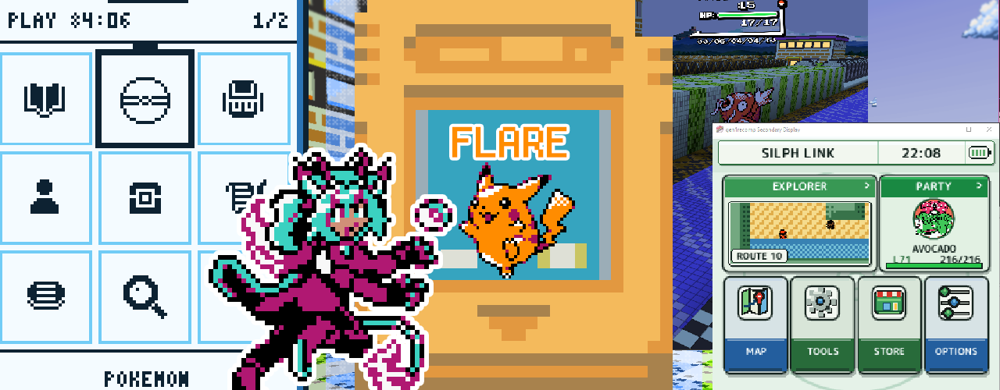

# Gen1Recomp Flare Yellow Custom Cart
A vanilla+ experience that includes Shiny, Quests, Voxel Ascendant, Gen 2 Sprites,UI Mods,and QOL Mods.

### Tested for Desktop Only

  

| Hotkeys Feature | Keyboard | X-input Controller |
| :--- | :--- | :--- |
| **Voxel Ascendant POV Change** | V | SELECT |
| **Kanto Wild Overworld Catch** | C | Hold B + Press A |
| **Item Shortcut** | I | Y |
| **Fast item** | K | X |
| **Kanto Companion Overview** | O or F8 | R2 |
| **Kanto Companion Bag/ Item PC** | I | Y 2nd press |
| **Kanto Companion Party/ Box PC** | P | Y |
| **Close Kanto Companion Widgets** | ESC | B |

Flare Yellow is a 45 mod vanilla+ modpack that includes QOL, Quests, Voxel, Gen 2 Sprites, UI Mods, and Shiny Mods.The Music is primarily HGSS. This cart was made to make the professor oak challenge much more fun and engaging to revisit my first pokemon game.It comes package with dynamic scaling and dynamax to keep up with the over leveling that comes with some challenges.

### Features:
- Dynamax Gimmick
- Crystal Sprites and Gen 2 Trainer Sprite character selector
- Catch All 151 Pokemon
 - LV40~ Evolution for Link Trades Pokemon
- Shiny Pokemon with 1/100 Rates
- Floating HUD with Battle Cinematic Camera with Kanto Gear enhancements.
- Better Gen1 Menu and Modern UI Compat
- Infinite TMs
- HM moves are forgettable
- Relearn Moves, Change Nicknames or Edit DV/EV in Menu
- Find Catchable Pokemon in your location with DexNav or Kanto Gear
- Access PC anywhere with with Kanto Companion
- Play the game your way with QOL toggles
- Rematch trainers
- Trainers Team Scale Dynamicly
- Item Finder passively makes hidden Items shine
- Add items to the quick shortcut menu from the menu.
